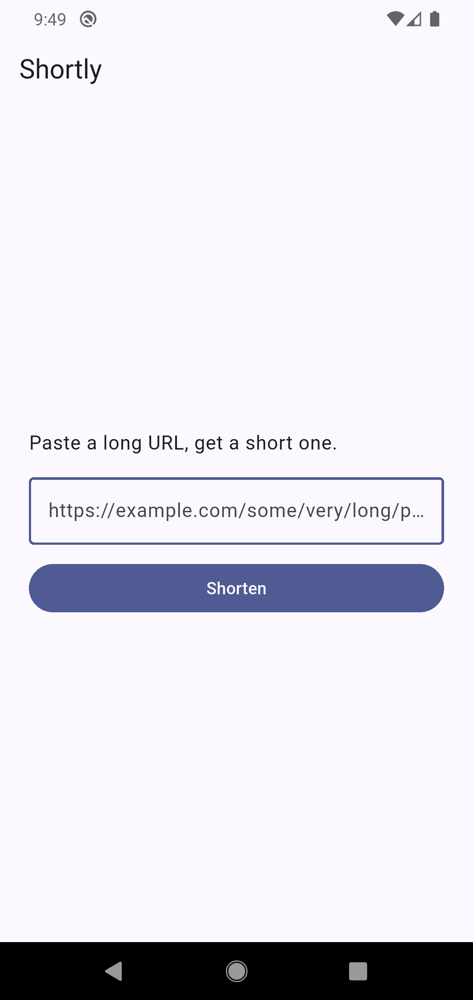
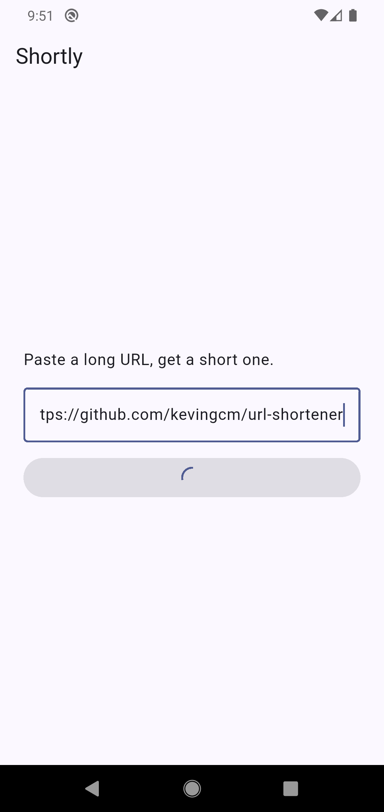
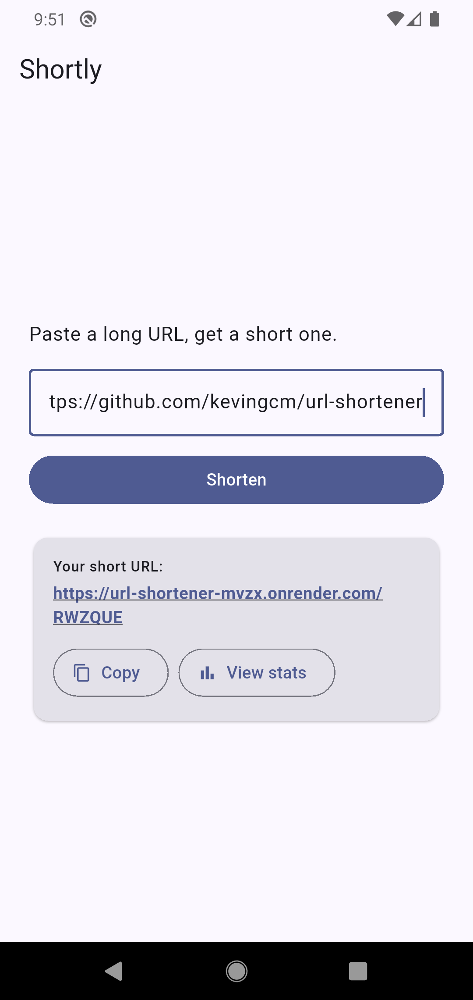

# Shortly — URL shortener with analytics

A URL shortener with per-link click analytics, built as a hands-on database learning project. SQL is raw (no ORM) and the project includes a SQLite → PostgreSQL migration so the differences between them are visible, not hidden. **One Flutter codebase powers the web and the Android app** — both hit the same Node.js + Express API backed by PostgreSQL on Neon.

**Live demo:** https://url-shortener-mvzx.onrender.com
*(First request after idle may take ~30s on Render's free tier to spin up.)*

<p align="center">
  
  
  
</p>

## Features

- Shorten any `http(s)` URL to a 6-character code
- Redirect `/:code` → original URL (302)
- Record every click with timestamp, referrer, user-agent
- Per-URL stats: total clicks, clicks by day, top referrers
- Pull-to-refresh and refresh button on the stats screen
- Tap a URL to open it, long-press to copy
- Local **history** of the last 20 URLs shortened on this device, persisted via `shared_preferences`
- Custom launcher icon, native splash screen, and PWA icons

## Tech stack

**Backend**
- **Node.js** + **Express 5** — raw SQL, no ORM
- **PostgreSQL** on [Neon](https://neon.tech) (production) — started on **SQLite** and migrated, to learn the differences
- Deployed on [Render](https://render.com)

**Frontend (web + mobile)**
- **Flutter** (Dart) — one codebase targets browser and Android
- Material 3 + **Lexend** font (via `google_fonts`)
- Web build output is committed to `public/` and served by Express as static assets

## Running locally

### Backend

Prerequisites: Node 20+, a PostgreSQL connection string (Neon free tier works).

```bash
npm install
cp .env.example .env           # edit .env, paste your DATABASE_URL
npm run migrate:pg             # creates schema (+ copies urls.db if present)
npm start                      # http://localhost:3000
```

### Flutter app

Prerequisites: Flutter 3.19+.

```bash
cd app
flutter pub get
flutter run -d chrome          # fastest dev loop — opens in Chrome
# or:
flutter run                    # uses a connected Android device / emulator
```

The Dart client picks its API base URL at runtime (`app/lib/api.dart`): on web it uses relative URLs (same origin as the Flutter web app's host); on mobile it hard-codes the production Render URL.

### Rebuilding the unified web frontend

Every web UI change requires rebuilding Flutter → committing `public/`:

```bash
cd app
flutter build web --release
cd ..
rm -rf public && cp -r app/build/web public
git add app public && git commit -m "..." && git push
```

Render auto-deploys on push to `main`. (Render's build environment doesn't have Flutter; that's why the built output is committed rather than built on the server.)

## Running ad-hoc SQL

Query files live in `queries/`. Run any of them against your Postgres DB:

```bash
npm run sql -- queries/clicks_per_url.sql
```

## Project layout

```
├── server.js                 Express routes (shorten, redirect, stats) + CORS, trust proxy
├── db.js                     Postgres connection pool + schema init
├── sql.js                    Tiny runner for ad-hoc .sql files
├── migrate-to-postgres.js    One-off: creates schema + copies SQLite → PG
├── queries/                  Example SQL files
├── public/                   Flutter web build output (served by Express)
├── tools/                    One-off Node scripts (SVG → PNG icon/favicon generation)
└── app/                      Flutter project — web + Android from one codebase
    ├── assets/               icon.svg / icon.png / splash.svg / splash.png
    ├── web/                  web-specific assets (favicon, PWA icons, index.html template)
    └── lib/
        ├── main.dart         entry + theme (Lexend, Material 3)
        ├── home_screen.dart  URL input, result card, local history list
        ├── stats_screen.dart pull-to-refresh + tap/long-press URL links
        ├── api.dart          HTTP client, shortenUrl() / fetchStats()
        └── history.dart      shared_preferences-backed local history
```

## Data model

```
urls                                clicks
────                                ──────
id          SERIAL PK              id          SERIAL PK
short_code  TEXT UNIQUE       ←─   url_id      INTEGER FK → urls(id)
long_url    TEXT                   clicked_at  TIMESTAMPTZ
created_at  TIMESTAMPTZ            referrer    TEXT
                                   user_agent  TEXT
```

Indexes:
- `urls.short_code` — implicit, from `UNIQUE`
- `idx_clicks_url_id` — stats queries filter by `url_id`
- `idx_clicks_clicked_at` — for time-range queries

Foreign keys are `ON DELETE CASCADE`, so deleting a URL drops its clicks atomically.

## API

| Method | Path               | Description                                     |
|--------|--------------------|-------------------------------------------------|
| POST   | `/api/shorten`     | Body: `{ "url": "https://…" }` → `{ short_code, short_url, long_url }` |
| GET    | `/api/stats/:code` | JSON: short/long URL, total clicks, clicks by day (last 30), top referrers |
| GET    | `/:code`           | Records a click, 302 redirects to the long URL  |

CORS is enabled (`*`) so the same API can serve any frontend you point at it.

## Regenerating icons and splash

Source assets live in `app/assets/` as SVG. To regenerate PNGs after editing:

```bash
cd tools
npm install
node svg-to-png.js ../app/assets/icon.svg   ../app/assets/icon.png   1024
node svg-to-png.js ../app/assets/splash.svg ../app/assets/splash.png 512
node gen-web-icons.js                        # favicon + PWA icons for app/web/
cd ../app
flutter pub run flutter_launcher_icons       # Android launcher
dart run flutter_native_splash:create        # native splash
```
